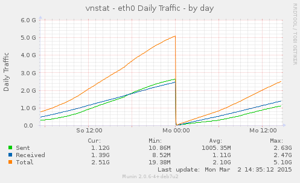
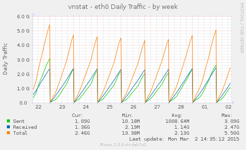
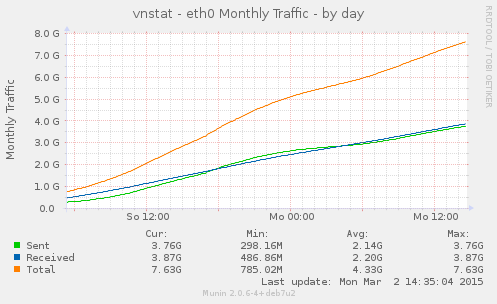
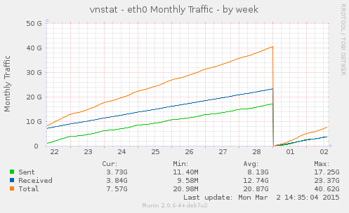

Munin-plugins for vnstat
========================
`vnstat_day_` and `vnstat_month_` are very simple (bash-based) munin plugins which can be used to monitor the daily and monthly traffic of several network interfaces using vnstat.

> Hint: For information about usage, configuration and the authors take a look at the comments inside the scripts.

Examples:
---------

